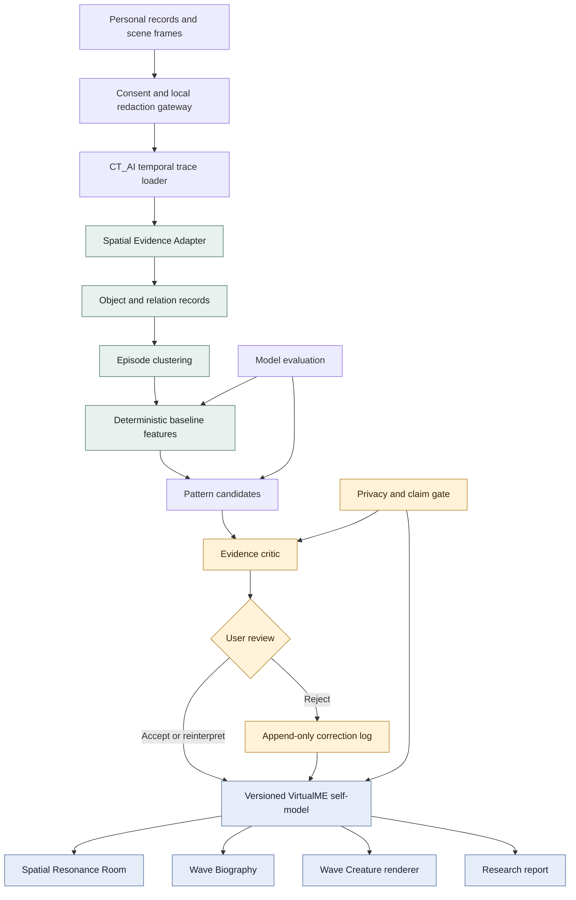
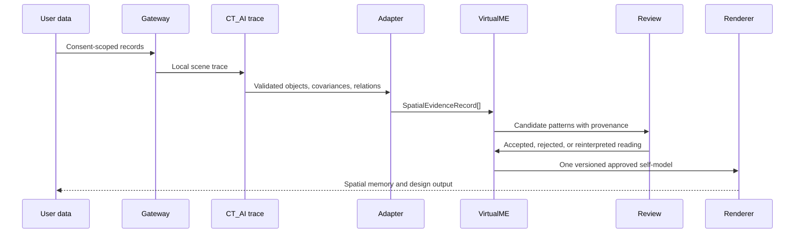

# VirtualME x CT_AI System Architecture

## Ownership boundaries

| Component | Responsibility | Must not do |
|---|---|---|
| Consent gateway | consent, redaction, local routing | invent missing records |
| CT_AI trace loader | validate temporal 3D trace | interpret personal intent |
| Spatial Evidence Adapter | normalize objects, relations, uncertainty | infer emotion or personality |
| Episode clustering | group records from one occasion | count one occasion as many witnesses |
| Baseline features | deterministic aggregate measurements | present features as conclusions |
| Evidence critic | reject unsupported claims | rewrite evidence silently |
| User review | choose or correct readings | alter computed confidence |
| Renderer | render the approved model | add unobserved objects or fill gaps |
| Model evaluation | compare baselines and models | use random splits when they leak time or space |

## Data flow invariant

The adapter is observational. `SpatialEvidenceRecord.evidence_class` is `contextual` until a separate reviewable process establishes a stronger evidence classification.
